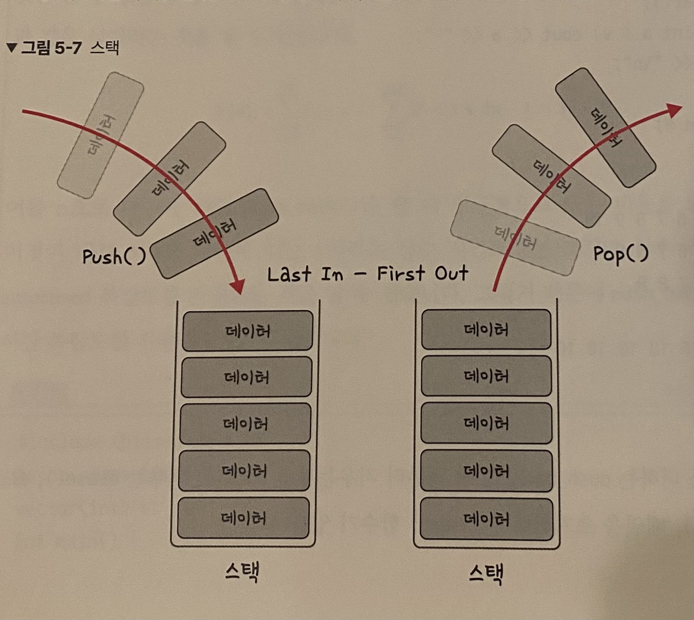
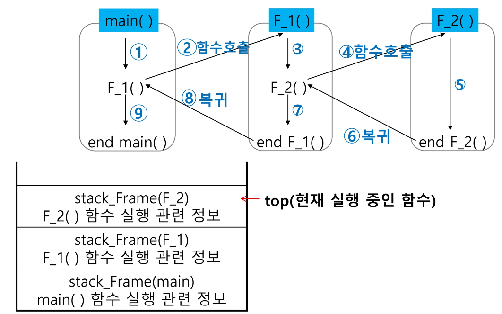
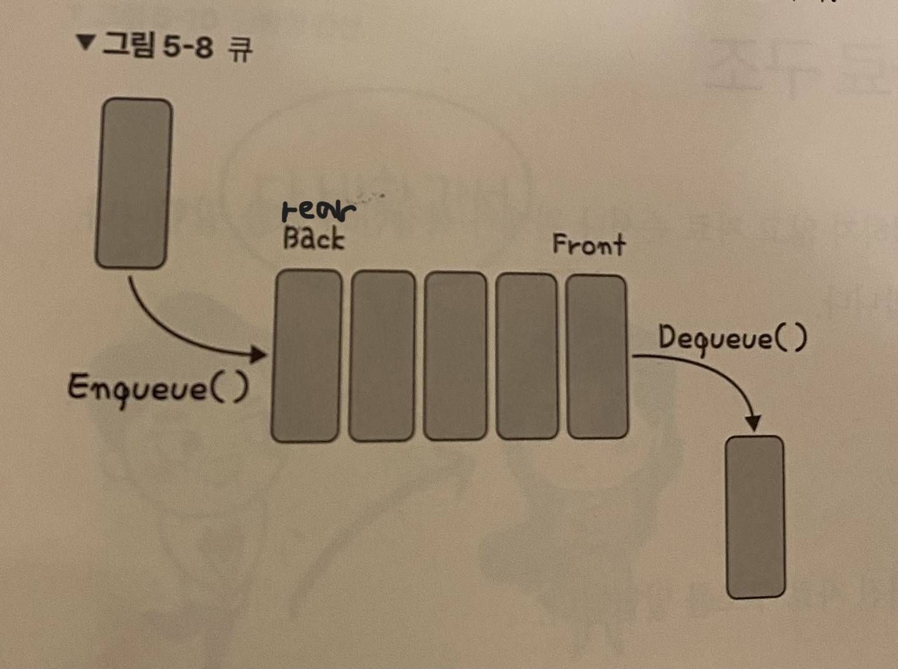
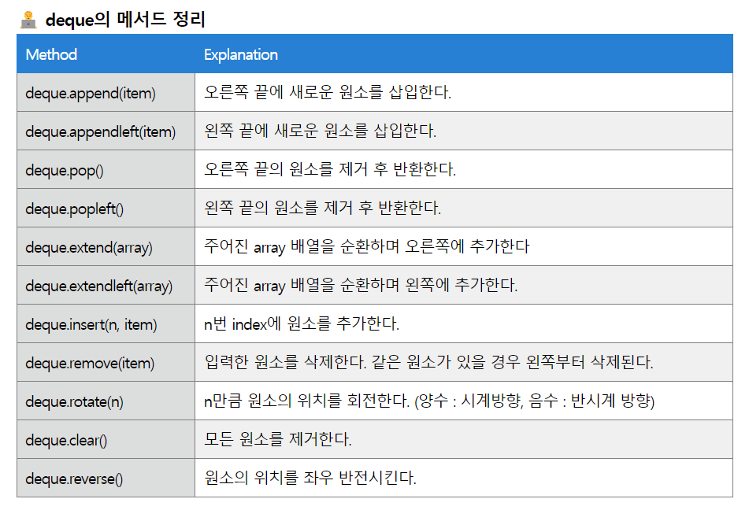

## 1. 스택(Stack)



#### 1. 스택 개념, 특징

- 스택은 가장 마지막에 저장된 데이터를 가장 먼저 꺼내는 **후입선출(LIFO, Last In First Out)구조**임.

- 스택은 **한 쪽 끝에서만(top)** 데이터의 삽입(push)과 삭제(pop)가 가능함.

- 스택은 배열 또는 연결리스트로 구현 가능함

- 다만 들어간 순서대로 넣고 뒤에서부터 꺼내니 **배열로 구현하는 것이 유리**함

- 시간복잡도 : 삽입 및 삭제에 O(1), 탐색에 O(n)이 걸림.

#### 2. 스택 용어

1. **top(peek)**

- 가장 최근에 저장된 데이터이자 먼저 삭제 될 데이터 

- **스택의 맨 위 요소, top 에만 접근이 가능하기 때문에 top이 아닌 위치의 데이터에 대한 접근, 삽입, 삭제는 모두 불가능하다.**

- top 특징으로 인한 스택의 장단점

    - top을 통해 접근하기 때문에 데이터 접근, 삽입, 삭제가 빠르다.

    - top 위치 이외의 데이터에 접근할 수 없기 때문에 탐색이 불가능하다. 탐색하려면 모든 데이터를 꺼내면서 진행해야한다.


2. push : 데이터를 삽입하는 것을 말하며, 삽입된 데이터는 삭제 시 가장 먼저 삭제될 데이터가 된다.


3. pop : 데이터를 삭제할 때 사용하며 가장 최근에 저장된 데이터가 삭제된다.


4. isEmpty : 스택이 비어있는지 검사.. 스택이 빈 경우 true를, 비어 있지 않은 경우 false를 반환한다.


5. isFull : 스택이 꽉 찼는지 검사


#### 3. 스택 사용 예시

1. 함수 호출 + 복귀(+재귀함수)

    

- 프로그램에서의 함수 호출과 복귀에 따른 수행순서를 관리

- 가장 마지막에 호출된 함수가 가장 먼저 실행을 완료하고 복귀하는 **후입선출 구조**이므로, 후입선출 구조의 스택을 이용하여 수행순서 관리

- 함수 호출이 발생하면 호출한 함수 수행에 필요한 지역변수, 매개변수 및 수행 후 복귀할 주소 등의 정보를 스택 프레임(stack frame)에 저장하여 시스템 스택에 삽입

- 함수의 실행이 끝나면 시스템 스택의 top 원소(스택 프레임)를 삭제(pop)하면서 프레임에 저장되어 있던 복귀주소를 확인하고 복귀

- 함수 호출과 복귀에 따라 이 과정을 반복하여 전체 프로그램 수행이 종료되면 시스템 스택은 공백 스택이 된다.

2. DFS, 괄호검사, 후위 연산법(계산기), 역순 문자열 출력 등

3. 웹 브라우저 방문 기록(역추적 작업이 필요할 때)

- 브라우저 뒤로가기

- 실행 취소(Ctrl + z)


#### 4. 스택 구현


1. 배열로 구현


2. 연결 리스트로 구현


3. 동적 배열 스택


## 2. 큐(Queue)



#### 1. 큐 개념, 특징

- 큐는 스택과 달리 한 쪽(rear)에서는 데이터 삽입, 다른 한 쪽(front)에서는 데이터 삭제만 가능한 **선입선출(FIFO, First In First Out)** 구조를 가지고 있습니다.

- 큐는 연결 리스트로 구현하는 것이 유리함(선입선출을 배열로 구현하면 데이터의 이동이 많아져서 overhead 가능성이 있음)

- 시간 복잡도 : 삽입 및 삭제에 O(1), 탐색에 O(n)이 걸립니다. 

#### 2. 큐 용어

- front : 데이터 삭제 위치 기억 => deQueue() : 데이터 삭제 연산

- rear : 데이터 삽입 위치 기억 => enQueue(item) : 데이터 삽입 연산

- isEmpty() : 비어있는 지 확인하는 연산

- isFull() : 꽉차있는 지 확인하는 연산


#### 3. 큐 사용 예시

1. 우선순위가 같은 작업 예약

2. 은행 업무, 프린터의 인쇄 대기열, 콜센터 고객 대기시간, 프로세스 관리

3. BFS 구현

4. 캐시(Cache) 구현


#### 4. 큐 종류와 구현

1. 선형 큐

```py
# 선형 큐 : 많이 씀
# 크기 n인 1차원 배열 생성

# 큐 초기화
size = 10
q = [0] * size
front = rear = -1

# 삽입 연산
def enqueue(item):
    global rear
    # 삽입하기전에 큐가 가득 찼는지 확인
    if isFull():
        print('full')
        return
    rear += 1       # 삽입 : rear + 1, rear자리에 값 삽입
    q[rear] = item 

# 삭제 연산
def dequeue():
    global front
    # 삭제 하기 전에 큐가 비어있는지 확인
    if isEmpty():
        print('empty')
        return
    front += 1
    return q[front]


# 큐가 가득 찼는지
def isFull():
    return rear == size - 1 # size-1 : 배열의 마지막 인덱스(n-1번째)

# 큐가 비어있는지
def isEmpty():
    return front == rear


# 삽입 활용
for i in range(10):
    enqueue(i)

print(q)
print(isEmpty())
print(isFull())

# 삭제 활용
for i in range(10):
    print(dequeue(), end = '')
print()

print(q)
print(isEmpty())
print(isFull())
```

2. 원형 큐

- 선형 큐를 원소의 삽입을 계속 진행할 경우, rear이 배열의 크기를 넘어서는 순간, 포화상태로 인식하여 더 이상 삽입을 수행하지 않음

- 배열의 처음과 끝을 연결시켜 원형 큐 가정

- 큐의 원소들을 앞으로 이동시킴

- rear = (rear + 1)% size

```py
# 원형 큐
# idx 순환 : (rear/front + 1) % size => 다시 되돌아감.. 


# 초기화
size = 10
cq = [0] * size
front = rear = 0 # 원형 큐


# 삽입
def enqueue(item):
    global rear
    # 큐가 가득차있으면 삽입 x
    if isFull():
       print('full')
       return
    rear = (rear+1) % size # 원소를 넣을 곳은 rear+1인데, 벗어나는 순간 0부터 다시 시작하도록
    cq[rear] = item


# 제거
def dequeue():
   global front
   if isEmpty():
      print('empty')
      return
   front = (front + 1) % size
   return cq[front]

def isFull():
   return (rear + 1) % size == front # rear의 idx가 돌면서 정착한 지점이 front인 경우 
   
def isEmpty():
   return front == rear


# 삽입 활용
for i in range(10):
    enqueue(i)

print(cq) # front가 공백으로 삽입되어 있어서 9는 출력되지 못했음
print(isEmpty())
print(isFull())


# 삭제 활용
for i in range(10):
    print(dequeue(), end = '')
print()

print(cq)
print(isEmpty())
print(isFull())

for i in range(90,100):
   enqueue(i)
print(cq) # 8은 front 위치


```


3. 연결리스트 큐?


이를 개선한 것이 '연결리스트 큐'

##### 연결리스트 큐는 크기가 제한이 없고 삽입, 삭제가 편리


## 3. 덱(Deque, Double-ended Queue)

#### 1. 개념, 특징

- 스택과 큐가 합쳐진 형태

- 양쪽 모든 방향(front, rear)에서 삽입 및 삭제가 가능해짐

- 시간 복잡도 : 단순히 값을 삽입하고 삭제하는 용도로만 활용할 때는 O(1)만큼의 시간밖에 할애되지 않기 때문에 아주 효율적임

    